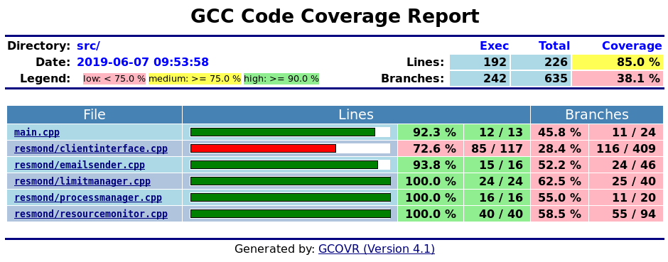

# Dokumentacja użytkownika
## Przedstawienie aplikacji Resmond
Resmond (ang. **Res**ource **Mon**itor **D**eamon) jest oprogramowaniem służącym do monitorowania 
procesów działających w systemie. Program rejestruje wartości zasobów zużywanych przez procesy i 
informuje o nich dedykowanych użytkowników. Aplikacja została napisana w architekturze klient-serwer. 
Oba moduły pracują lokalnie w obrębie jednego komputera. Komunikacja między klientem i 
serwerem realizowana jest z wykorzystaniem protokołu TCP, służącego do przyjmowania poleceń od 
klienta. 

## Przygotowanie do pracy z programem
### Wymagania systemowe
Przed pobraniem programu należy zainstalować oprogramowanie kluczowe do jego uruchomienia. W skład 
wspomnianego oprogramowania wchodzą:

* ```CMake (wersja przynajmniej 3.10)```
* ```boost (wersja przynajmniej 1.56.0)```

### Pobranie aplikacji z repozytorium Git
W celu rozpoczęcia pobrania monitora zasobów na swój komputer należy uruchomić terminal i w określonym 
 przez nas katalogu docelowym wykonać poniższe komendy:

```bash
git clone --recurse-submodules  https://github.com/wojtasRobert/ZPR-19L.git
```

### Budowanie plików
Następnie należy zbudować pliki w utworzonym ręcznie katalogu ```build```:

```
cd ZPR-19L/
mkdir build
cd build
cmake ..
make
```

## Praca z programem
### Uruchamianie
Po wykonaniu komend z poprzedniej sekcji i prawidłowej konfiguracji, możemy uruchomić poszczególne elementy programu: monitor
 zasobów, testy, pokrycie kodu testami:

```bash
   # Deamon
   ./resmond
```

```bash
   # Test
   ./test_executable
```

```bash
   # Coverage
   make ctest_coverage
```


### Klient
Klient ```resmond``` jest skryptem napisanym w Pythonie, łączącym się z usługą poprzez protokół TCP. 
Zapewnia on interfejs poleceń dla użytkownika. W zależności od wpisanej komendy oraz jej atrybutów, klient 
wysyła zapytania do serwera pod odpowiedni wskazany wcześniej adres. 

#### Komendy dostępne w programie

```bash
NAME
    status - wyświetl informacje 
    
SYNOPSIS
    status
    
DESCRIPTION
    Status wyświetla informacje o aktualnym stanie monitora zasobów. Po wywołaniu komendy drukowana 
    jest lista procesów będących pod obserwacją wraz ze wszystkimi atrybutami (id procesu, zużycie CPU, 
    MEM, limity CPU, MEM, nazwa polecenia. 
    
```

```bash
NAME
    spawn - utwórz i monitoruj
    
SYNOPSIS
    spawn command
    
DESCRIPTION
    Komenda spawn służy do utworzenia procesu oraz podpięcia go do monitora zasobów. Po utworzeniu 
    można mamy dostęp do informacji na temat zużycia zasobów przez proces.    
```

```bash
NAME
    terminate - usuń proces z monitorowanych
    
SYNOPSIS
    terminate id
    
DESCRIPTION
    Komenda terminate służy do usunięcia z listy procesów obserwowanych przez monitor zasobów oraz 
    wyczyszczenie zdefiniowanych dla procesu limitów.
```

```bash
NAME
    limits - nałóż limity na proces
    
SYNOPSIS
    limits id [--cpu, -c float ] [--memory, -m float ]
    
DESCRIPTION
    Komenda limits umożliwia nałożenie ograniczeń na zużycie zasobów przez procesy. Istnieje możliwość 
    nałożenia ograniczeń na każdy zasób z osobna. Wartości podawane przez użytkownika powinny być w zakresie 
    od 0 do 100 - są to wartości procentowe.
```

# Diagram klas


# Statystyki

## Liczba linii kodu

| Rozszerzenie | Pliki  | Linie   |
| ------------ | :----: | :-----: |
| cpp          | 10     | 451     |
| hpp          | 6      | 269     |
| **Suma**     | **16** | **720** |

## Liczba testów

* 3 test cases
* 12 checks

## Pokrycie kodu testami



## Czas poświęcony na projekt

ok. 20 h

# Problemy i przemyślenia

* Niewielka zmiana struktury logicznej projektu względem dok. wst.
* Brak kolejki wiadomości mailowych do wysłania.
* Brak grupowania wiadomości
* Możliwe jest zrezygnowanie z wstrzykiwania zależności na rzecz agregacji dla niektórych klas.
* 