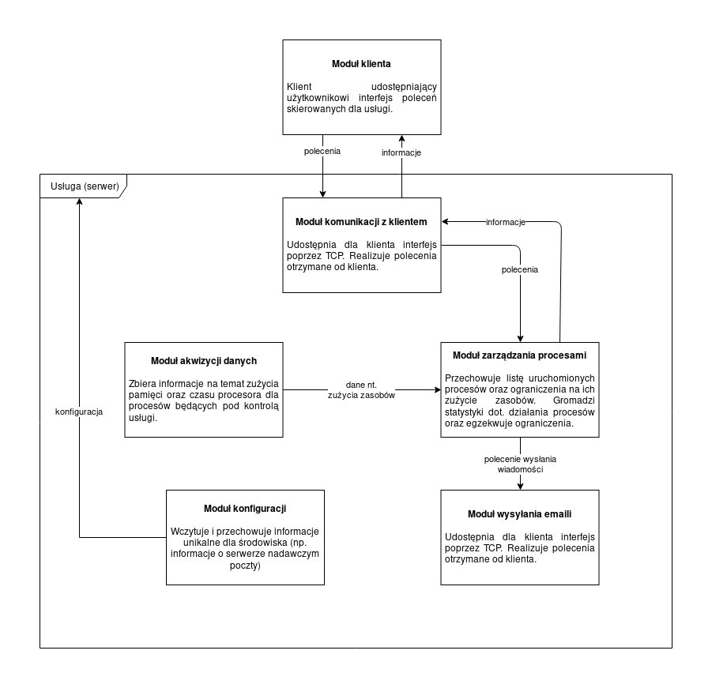

% Monitor zasobów -- dokumentacja wstępna
% Robert Wojtaś, Krystian Chachuła
% 27 marca 2019

## Docelowa funkcjonalność aplikacji

## Zakres realizowanych funkcji

## Opis architektury

### Klient

Funkcje klienta, służące do kontrolowania usługi:

* dodaj proces do obserwowanych
* usuń proces z obserwowanych
* pokaż informacje na temat obserwowanego procesu
* ustaw/zmień ograniczenia wykorzystania zasobów przez obserwowany proces

### Usługa

* udostępnia w sieci gniazdo TCP, służące do przyjmowania poleceń od klienta
* monitorowanie %MEM oraz %CPU

#### Moduł akwizycji danych

 TODO: to są różne pomysły, należy coś wybrać
 
 
##### Linux

* `ps -p $PID -o %cpu,%mem,cmd`
* https://stackoverflow.com/a/64166

# TODO
* funkcje klienta
* opis architektury
  * serwer
    * moduł akwizycji danych
    * moduł kom z klientem
    * moduł zarządzania procesami
    * moduł wysyłania maili
    * moduł zarządzania konfiguracją (wczytywanie z pliku?)
    * moduł sprawdzania ograniczeń
* diagram: klient, serwer, procesy, lista procesów i jakie informacje są wymieniane
* fork czy podpinanie procesu
* serwer uruchamiany oddzielnie i klient oddzielnie
